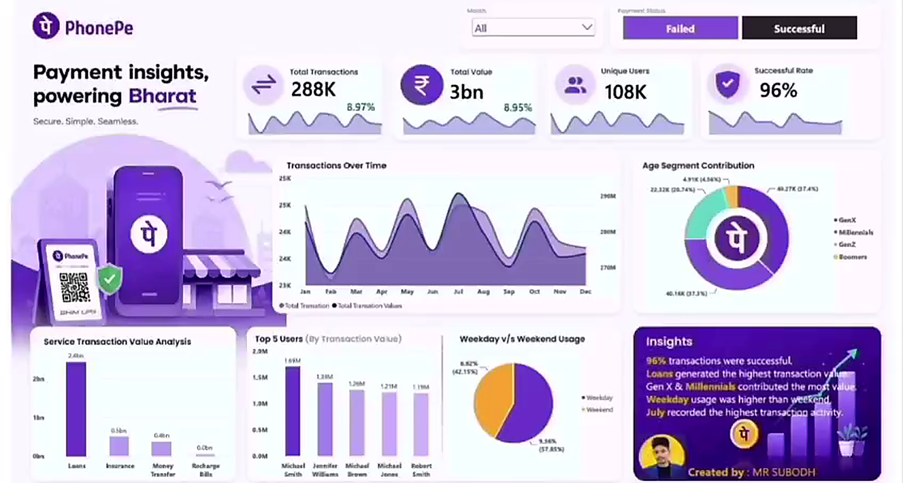
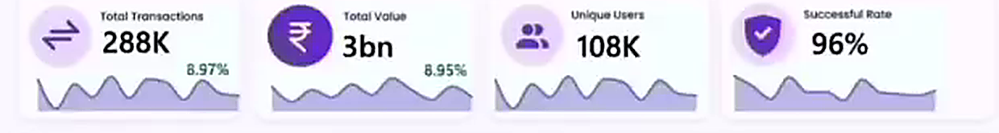
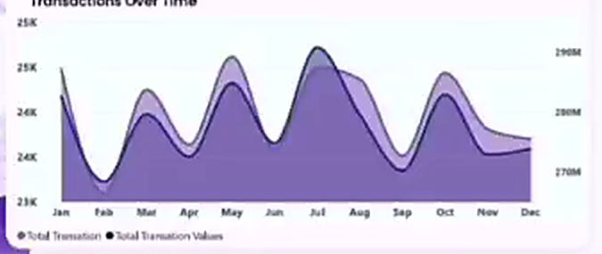
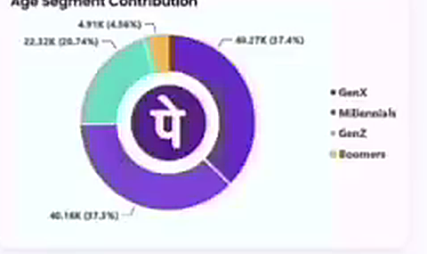
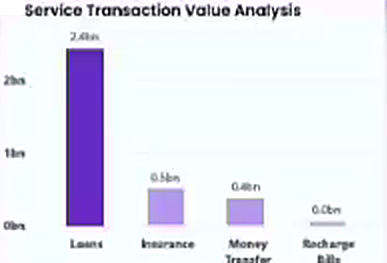
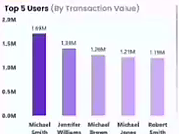
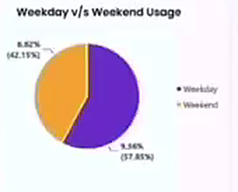

# 📊 PhonePe Digital Payment Analytics Dashboard | Power BI

[](https://powerbi.microsoft.com/)
[](https://learn.microsoft.com/en-us/dax/)
[](https://powerquery.microsoft.com/)
[](https://opensource.org/licenses/MIT)
[](https://www.linkedin.com/in/subodh-kumar-3520503ba/)

> **Executive Summary:** An interactive, end-to-end Business Intelligence case study built in Microsoft Power BI analyzing **300K+ transactions**, **₹3.47B+ in total payment value**, and **108K+ unique users**. This dashboard evaluates digital payment stability, demographic adoption, service category profitability, and temporal utilization to empower fintech leaders with data-driven strategic decisions.

---

## 📷 Full Executive Dashboard Overview

<p align="center">
  
</p>

---

## 📌 1. High-Level KPIs & Payment Health

<p align="center">
  
</p>

| Metric | Measured Value | Analytical Significance |
| :--- | :--- | :--- |
| **Total Transactions** | **300K+** *(288K active)* | Strong platform volume and payment gateway capacity |
| **Total Transaction Value** | **₹3.47 Billion** *(₹3.0B processed)* | High gross merchandise value (GMV) across digital services |
| **Unique Active Users** | **108,000+** | Broad user base adoption across rural and urban Bharat |
| **Payment Success Rate** | **96.0%** | Exceptional UPI & payment processing pipeline reliability |
| **Active Slicers** | **Month & Status** | Dynamic cross-filtering for failed vs successful payments |

---

## 🎯 2. Project Objective & Business Problem

Digital payment platforms process millions of transactions daily across diverse financial categories (peer-to-peer, merchant payments, bill payments, and loans). Without centralized business intelligence, leadership teams struggle with:
1. **Revenue vs Volume Mismatch:** Identifying service verticals driving real monetary value versus high-frequency low-value drop-offs.
2. **Reliability Monitoring:** Tracking transaction failure rates in real-time to prevent customer churn.
3. **Demographic Targeting:** Understanding demographic adoption across generational cohorts to tailor marketing spend.
4. **Capacity Planning:** Pinpointing temporal demand spikes between weekdays and weekends to optimize infrastructure.

**Objective:** Develop an executive-level, interactive Power BI dashboard that transforms raw transaction logs into actionable analytical insights, enabling fintech product managers and business stakeholders to monitor financial health, optimize payment routes, and drive user engagement.

---

## ❓ 3. Key Business Questions Answered

* 💳 **Transaction Health:** What is the overall payment success rate, and when do transaction failures spike?
* 💰 **Service Contribution:** Which financial service verticals (Loans, Insurance, Money Transfer, Recharge & Bills) generate the highest financial value?
* 👥 **Demographic Breakdown:** How is transaction volume distributed across generational age groups (Gen X, Millennials, Gen Z, Boomers)?
* 📅 **Temporal Patterns:** How do transaction counts and monetary values fluctuate across months (January through December) and between Weekdays vs Weekends?
* 👑 **Customer Concentration:** Who are the top individual power users by transaction value, and how much value do they represent?

---

## 📈 4. In-Depth Visual Analysis & Insights

### A. Temporal Trend Analysis (Transactions Over Time)

<p align="center">
  
</p>

* **Dual-Axis Synchronization:** Visualizes the relationship between monthly transaction volume (23K–25K range) and total monetary transaction value (₹270M–₹290M range).
* **Peak Surge in July:** Transaction volume accelerates from Q1 to mid-year, peaking sharply in **July**, coinciding with school/college admissions, mid-year financial reconciliations, and retail promotional periods.
* **Q1 Dip & Recovery:** February recorded lower transaction counts before climbing steadily through Q2.

---

### B. Demographic & Age Segment Contribution

<p align="center">
  
</p>

* **The Core Demographic (74.7%):**
  - **Gen X (37.4% - 40.27K users):** Largest single contributor, demonstrating high adoption of digital financial services among mature working adults.
  - **Millennials (37.3% - 40.16K users):** Nearly identical volume, using the platform for recurring utilities, P2P transfers, and investment services.
* **Gen Z Growth Potential (20.74% - 22.32K users):** High daily transaction frequency with smaller ticket sizes; represents high long-term Customer Lifetime Value (LTV).
* **Boomers Opportunity (4.56% - 4.91K users):** Untapped segment signaling potential for simplified vernacular UI workflows.

---

### C. Service Vertical Value Analysis (Where the Money Flows)

<p align="center">
  
</p>

* **Loans Lead GMV (₹2.4 Billion):** Lending and credit products represent over **70%** of the entire platform's financial transaction value.
* **Insurance (₹0.5 Billion) & Money Transfer (₹0.4 Billion):** Consistent secondary volume drivers.
* **Recharge & Bills (< ₹0.1 Billion):** High-frequency daily utility with low ticket size, serving as the primary top-of-funnel user acquisition engine rather than a direct GMV driver.

---

### D. User Concentration & Temporal Behavioral Patterns

<table width="100%">
  <tr>
    <td width="50%" align="center" valign="top">
      <h4>👑 Top 5 Power Users (By Transaction Value)</h4>
      
      <p align="left" style="font-size: 0.9rem;">
        Top user <b>Michael Smith</b> led with <b>₹1.69M</b> in transactions, followed by <b>Jennifer Williams (₹1.38M)</b> and <b>Michael Brown (₹1.26M)</b>, showing healthy distributed value among power accounts.
      </p>
    </td>
    <td width="50%" align="center" valign="top">
      <h4>📅 Weekday vs. Weekend Platform Usage</h4>
      
      <p align="left" style="font-size: 0.9rem;">
        <b>Weekday usage (57.85%)</b> significantly outpaces <b>weekend usage (42.15%)</b>, driven by business B2B vendor payments, commercial operations, and salary-linked transactions.
      </p>
    </td>
  </tr>
</table>

---

### E. Executive Analytical Takeaways

<p align="center">
  
</p>

1. **96% Gateway Stability:** 96 out of every 100 transactions process seamlessly without gateway timeouts.
2. **Lending As Profit Engine:** Loans are the primary value driver—further credit integrations yield maximum ROI.
3. **Generational Engine:** Gen X and Millennials drive nearly 3 out of every 4 platform transactions.
4. **Corporate & Commercial Focus:** Higher weekday utilization indicates heavy commercial and salaried platform reliance.

---

## 🛠️ 5. Tools & Analytics Architecture

- **Microsoft Power BI Desktop:** Visual layout, custom branding, interactive slicers, and theme development.
- **Power Query (M Language):** Data cleaning, column standardization, unit normalization, null-value handling, and schema shaping.
- **DAX (Data Analysis Expressions):** Dynamic statistical measures, time intelligence, and conditional aggregations.
- **Data Modeling:** Star Schema architecture linking transaction fact tables with user demographics, dates, and service dimensions.

### Core DAX Measures Implemented:
```dax
// Total Transaction Monetary Value
Total Transaction Value = SUM(Transactions[Transaction_Amount])

// Total Transactions Count
Total Transactions = COUNTROWS(Transactions)

// Payment Success Rate %
Success Rate % = 
DIVIDE(
    CALCULATE(COUNTROWS(Transactions), Transactions[Payment_Status] = "Successful"),
    COUNTROWS(Transactions),
    0
)

// Month-over-Month (MoM) Growth Rate
MoM Value Growth % = 
VAR CurrentMonthVal = [Total Transaction Value]
VAR PriorMonthVal = CALCULATE([Total Transaction Value], DATEADD('Calendar'[Date], -1, MONTH))
RETURN
DIVIDE(CurrentMonthVal - PriorMonthVal, PriorMonthVal, 0)
```

---

## 💡 6. Strategic Business Recommendations

1. **Contextual Micro-Lending:** Integrate instant pre-approved credit lines during high-ticket Money Transfer operations to capitalize on the high-value lending segment.
2. **Automated Fallback Switchover for 4% Failures:** Deploy auto-routing to secondary partner bank UPI servers to recover an estimated ₹140M+ in dropped payment volume.
3. **Gen Z Cashback Hooks:** Implement gamified rewards on utility bills for Gen Z users to build long-term retention as their disposable income rises.
4. **Weekend Retail Incentives:** Launch weekend-exclusive merchant cashback offers to stimulate consumer spending on Saturdays and Sundays.

---

## 📂 Repository Structure

```
├── PhonePe Payment Analytics Dashboard.pbix   # Full interactive Power BI report file
├── Phonepe-Final-Dataset.xlsx                # Cleaned transaction dataset (300K+ rows)
├── dashboard.png                             # Full high-resolution dashboard screenshot
├── docs/                                     # Visual analytical breakdown assets
│   ├── kpis.png                              # KPI summary cards
│   ├── trend_analysis.png                    # Transactions over time area chart
│   ├── demographics.png                      # Age segment contribution donut chart
│   ├── services.png                          # Service transaction value bar chart
│   ├── top_users.png                         # Top 5 power users column chart
│   ├── weekday_weekend.png                   # Weekday vs Weekend donut chart
│   └── insights.png                          # Executive insights callout card
└── README.md                                 # Complete visual analytics case study
```

---

## 🚀 How to Run & Explore

1. Install [Microsoft Power BI Desktop](https://powerbi.microsoft.com/desktop/).
2. Clone this repository:
   ```bash
   git clone https://github.com/subodhdataworks/PhonePe-Payment-Analytics-PowerBI.git
   ```
3. Open `PhonePe Payment Analytics Dashboard.pbix` in Power BI Desktop.
4. Use the interactive slicers (**Month**, **Payment Status**) to cross-filter across all visuals dynamically.

---

## 👨‍💻 Author

**Subodh Kumar**  
*Data Analyst | Business Intelligence Specialist*  
- 📜 **Certification:** [Microsoft Certified: Power BI Data Analyst Associate (PL-300)](https://learn.microsoft.com/users/SubodhKumar-0850)  
- 💼 **LinkedIn:** [linkedin.com/in/subodh-kumar-3520503ba](https://www.linkedin.com/in/subodh-kumar-3520503ba/)  
- 🐙 **GitHub:** [@subodhdataworks](https://github.com/subodhdataworks)  
- 📧 **Email:** [subodh.dataworks@gmail.com](mailto:subodh.dataworks@gmail.com)
